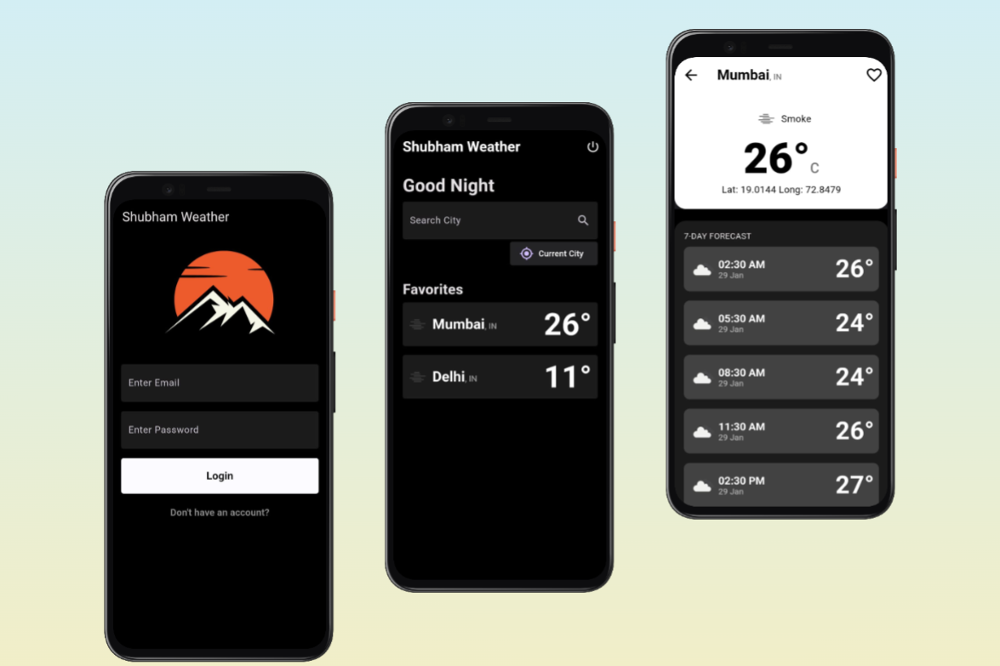

# FLutter Weather App with Firebase Authentication
Handcrafted by [Shubham Bane](https://www.linkedin.com/in/shubham-bane)

## Introduction

The Weather App is a feature-rich application designed to provide users with accurate weather forecasts. Leveraging Firebase Authentication for secure access, the app offers a seamless experience with a variety of functionalities and customization options.

## Screenshots




## Features

### Forecast Options

- **Current Day:** Real-time weather information for the current day.
  
- **7-Day Weather Forecast:** A comprehensive 7-day forecast for the selected location.

- **Multi-Region Forecast:** Explore weather forecasts for multiple regions over the next 7 days.

### Location Management

- **Favorites List View:** Mark locations as favorites and conveniently view them in a list.

- **Add and Remove:** Easily add or remove locations from your favorites list with intuitive swipe gestures.

### User Interaction

- **Custom User Greetings:** Personalized greetings enhance the user experience.

- **Toast Messages:** Informative toast messages for error handling and user guidance.

### Permissions and Connectivity

- **Permission Pop-up:** Clearly prompt users for necessary permissions.

- **Error Handling:** Informative toast messages for data fetching, permission issues, and internet connectivity problems.

## Firebase Authentication

The Weather App integrates Firebase Authentication for a secure and reliable sign-in/sign-up process. User data is protected, ensuring a trustworthy user experience.

## User Interface

### Customization

- **App Icon:** A visually appealing custom app icon for brand identity.

- **Splash Screen:** Engaging custom splash screen for a smooth app launch.

- **App Label:** Unique app label for easy identification.

- **No Internet Animation:** A customized animation to inform users about internet connectivity issues.

### Sign In and Sign Up

- **Awesome Sign In/Up Pages:** Well-designed sign-in and sign-up pages that enhance the overall aesthetic appeal.

## Functionality

### Location Services

- **Get Current Location:** Easily retrieve the user's current location for accurate local weather information.

- **Search Locations:** Effortlessly search for specific locations to get detailed weather forecasts.

### Forecast Details

- **7-Day Detailed Forecast:** Detailed weather information on a 3-hour basis for the next 7 days.

## Error Handling

### Toast Messages

- **Data Fetching Error:** Inform users when there is an issue fetching weather data.

- **Permission Issues:** Clearly communicate permission issues with informative messages.

- **Internet Connectivity:** Notify users of internet connectivity problems with custom toast messages.

## Customization

The Weather App goes beyond functionality to provide a unique and visually pleasing experience:

- **Custom User Greetings:** Enhance user engagement with personalized greetings.

- **Theme Customization:** Allow users to personalize the app's theme based on their preferences.

## Getting Started

### Prerequisites

Before you begin, ensure you have the following installed on your machine:

- [Flutter SDK](https://flutter.dev/docs/get-started/install)
- [Dart SDK](https://dart.dev/get-dart)

### Clone the Repository

```bash
git clone https://github.com/your-username/flutter-weather-app.git
```
### Navigate to the Project Directory
```bash
cd flutter-weather-app
```
### Install Dependencies
```bash
flutter pub get
```
### Firebase Configuration
1. Create a new project in the [Firebase Console](https://console.firebase.google.com/)
2. Add your Flutter app to the Firebase project.
3. Follow Firebase documentation for more detailed instructions on adding Firebase to your Flutter app.
### Run the App
```bash
flutter run
```
## License

This project is licensed under the [MIT License](LICENSE)
